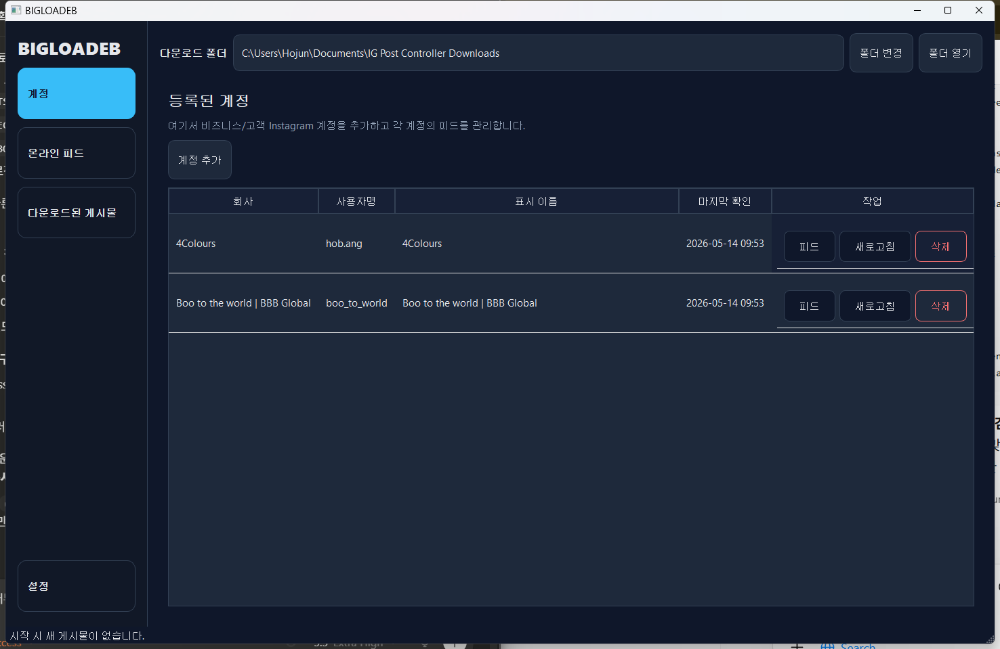
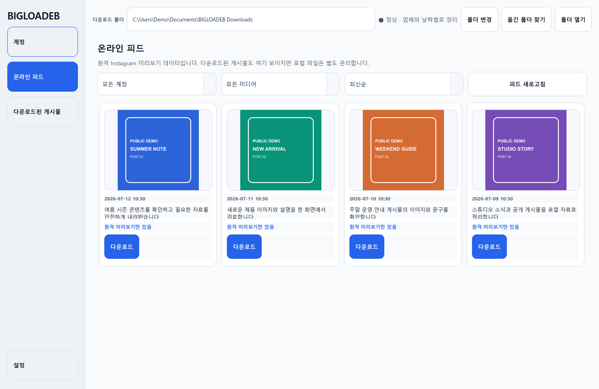
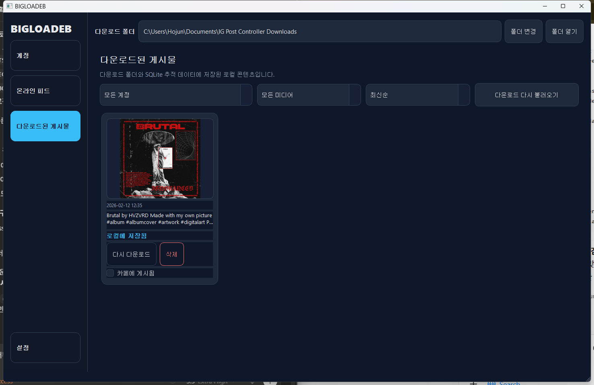

# BIGLOADEB

> 面向 Windows 的账号优先 Instagram 帖子收集与本地媒体管理工具。

[English](../README.md) | [한국어](README.ko.md) | [日本語](README.ja.md) | [中文](README.zh-CN.md)

BIGLOADEB 是一个 Windows desktop app，用于从多个 business/client accounts 收集和管理 public Instagram posts。

它面向年长或非技术 staff，重点是简单的 account-first workflow、清晰的 feeds，以及可预测的 local folder organization。

## Safety / Privacy Boundaries

- 只面向 public 或 authorized content。
- 不绕过 private access。
- 不保存 password 或 credential。
- media 和 metadata 存储在 local storage 与 SQLite 中。
- 不实现 upload/post automation。
- public Instagram access 可能受 Instagram 政策、rate limit 和 session 状态限制。
- 仅将其用于获得授权的用途和账号中的公开 Instagram 内容。

## Features

- 手动注册 public Instagram profile URLs。
- 从包含 username 和 display name 的 account list screen 开始。
- app launch 时检查 registered accounts 是否有 new posts。
- 查看 combined online feed 或 per-account feed。
- 按 image-only 或 video-only posts 过滤。
- 按日期排序。
- post detail view 支持 carousel、caption copy 和 media preview。
- 将 posts 下载到 account-based local folders。
- 使用 SQLite tracking downloaded posts。
- 将 downloaded posts 标记为 `posted to cafe`。
- 从 local storage 和 local tracking 删除 downloaded posts。
- 在 Settings 中切换 language 和 theme。

## Project Layout

- `ig_post_controller/` - app source code
- `tests/` - regression and smoke tests
- `build.ps1` - Windows release build script
- `build_debug.ps1` - console debug build
- `build_debug_onefile.ps1` - console one-file debug build
- `IGPostController.spec` - PyInstaller spec file

## Development Setup

```powershell
python -m venv .venv
.venv\Scripts\Activate.ps1
pip install -r requirements.txt
```

## Run in Dev Mode

```powershell
python -m ig_post_controller
```

## Windows Release

### Download

1. 打开本 repository 的 GitHub Releases page。
2. 下载 latest Windows release asset。
3. 如果 release 以 `.zip` 打包，请解压 archive。
4. 运行 `IGPostController.exe`。

### User Data Locations

- App settings and local database: `%LOCALAPPDATA%\IGPostController`
- Thumbnail cache: `%LOCALAPPDATA%\IGPostController\thumb_cache`
- Default download root: `Documents\BIGLOADEB Downloads`

## Build a Release

```powershell
.\build.ps1
```

release executable 会生成在 `dist\IGPostController.exe`。

## Versioning

application version 存储在 `ig_post_controller/version.py` 的 `__version__`。

## Known Limitations

- Public Instagram access 可能被 Instagram rate-limited 或 blocked。
- 不支持 stories、likes/comments counts、login/auth、role permissions、auto-update 或 upload automation。
- Original-quality downloads 受 Instagram 暴露的 best public media variant 限制。
- 仅用于您有权下载的公开内容。

## Demo Walkthrough

demo flow 会选择 registered Instagram account，检查 feed，然后查看 locally saved posts。

1. 运行 `dist\IGPostController.exe`。
2. 在左侧 navigation 中选择 `Accounts`。
3. 点击已注册账户行上的 `查看帖子` 按钮。
4. 在左侧 navigation 中选择 `Downloaded Posts`。
5. 查看已保存帖子卡片的缩略图、说明、`重新下载文件` 和 `删除` 操作。

应用打开后进入账户列表。点击账户行上的 `查看帖子` 按钮，开始检查该账户的帖子。



feed check 后，同一个 account list 会显示 latest check time 和 available action buttons。



打开 `Downloaded Posts` 可查看 saved post card，包括 thumbnail、caption 和 re-download/delete controls。



## 致谢与署名

如果您公开分支、演示、文章或衍生作品，烦请提及 [@Bum-Boo](https://github.com/Bum-Boo) 和原始仓库。此项仅为礼貌性的署名请求，不构成额外的许可条件或限制。
